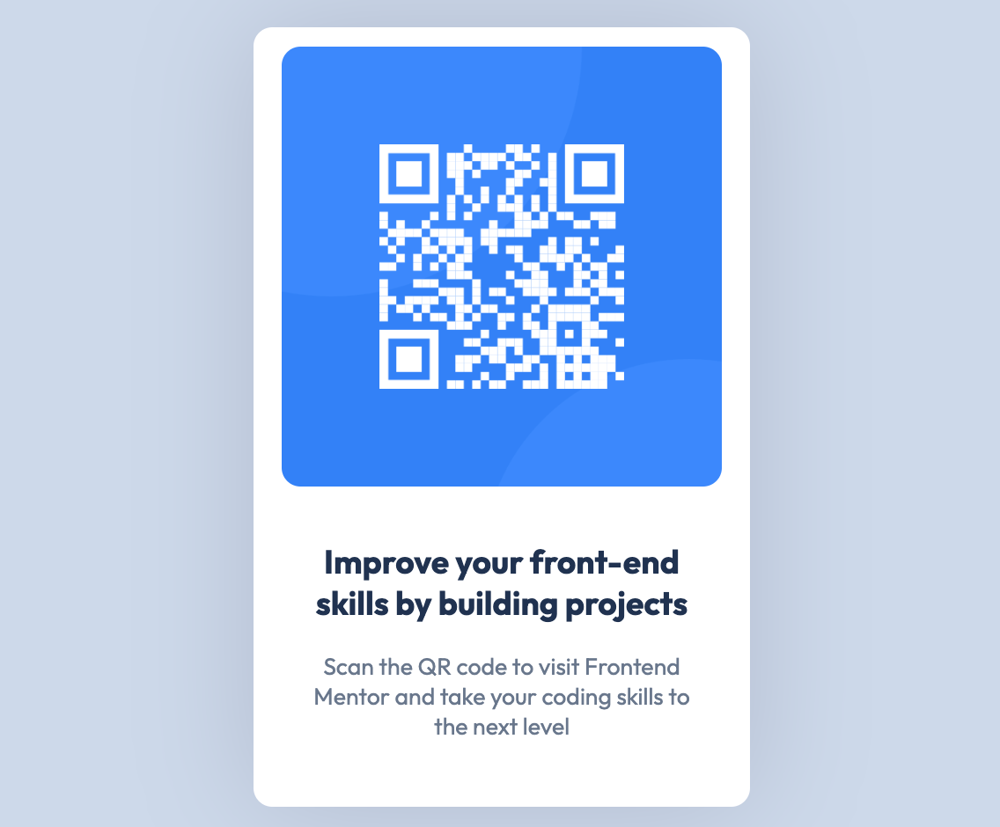

# Desafio - QR code component 

Este projeto foi criado como parte do desafio do Frontend Mentor, uma plataforma online que oferece projetos práticos para aprimorar suas habilidades em desenvolvimento front-end. 

Ao construir este projeto, você terá a oportunidade de aplicar seus conhecimentos em HTML e CSS com Mobile-first para criar interfaces de usuário responsivas.

## Sumário

- [Desafio - QR code component](#desafio---qr-code-component)
  - [Visão Geral](#visão-geral)
    - [Capturas de tela](#capturas-de-tela)
    - [Links](#links)
  - [Processo](#processo)
    - [Tecnologias utilizadas](#tecnologias-utilizadas)
    - [Fluxo de aprendizado](#fluxo-de-aprendizado)
    - [Desenvolvimento futuro](#desenvolvimento-futuro)
  - [Autoria](#autoria)

**Note: Delete this note and update the table of contents based on what sections you keep.**

## Visão Geral

### Capturas de tela




### Links

- Solution URL: [Add solution URL here](https://your-solution-url.com)

## Processo

### Tecnologias utilizadas

- HTML 5 semântico 
- CSS Puro
- Flexbox 
- Mobile-first e Desktop
- Node

### Fluxo de aprendizado

Nesta seção aprendi a trabalhar com sombremaento utilizado e efeito de sobrepor mouse. 

Busquei entende o código afim de melhorar a visualização das classes nomeando de acordo com a informação passada através de cada uma delas. 

Aproveitei para rever conceitos como flex display e design responsivo.

```html
<!- TRABALHANDO A SEMANTICA DO CÓDIGO->
<main>
    <section class="container">
      <div class="container-qrcode">
        
      </div>

      <div class="container-info">
        <h1>Improve your front-end skills by building projects</h1>
        <p>Scan the QR code to visit Frontend Mentor and take your coding skills to the next level</p>
      </div>

    </section>
    
    <footer class="attribution">
      Challenge by <a href="https://www.frontendmentor.io?ref=challenge" target="_blank" rel="noopener">Frontend Mentor</a>. 
      Coded by <a href="https://github.com/dev-jvcosta" target="_blank" rel="noopener">Devjohne</a>.
    </footer>
  </main>
```

```css
/* CONCEITOS DE FLEX E SHADOWS*/
.container{
    background-color: #fff;
    display: flex;
    flex-direction: column;
    max-width: 375px;
    justify-content: center;
    align-items: center;
    margin: 0 auto;
    padding: 1rem 1.5rem;
    border-radius: 16px;
    box-shadow: rgba(17, 12, 46, 0.15) 0px 0px 100px 0px;
}

.container-qrcode img{
    max-width: 100%;
    object-fit: contain;
    border-radius: 16px;
    /*APLICANDOEFEITOS*/
    transition: all 0.5s;
    cursor: pointer;
    
}

.container-qrcode img:hover{
    -webkit-filter: drop-shadow(15px 10px 5px rgba(0,0,0,.5));
    filter: drop-shadow(15px 10px 5px rgba(0,0,0,.5));
}
```

### Desenvolvimento futuro

Pretendo implementar dinamismo com JavaScript ou reformula o códgio para React.

**Note: Delete this note and the content within this section and replace with your own plans for continued development.**

## Autoria

- Website - [Add your name here](https://www.your-site.com)
- Frontend Mentor - [@yourusername](https://www.frontendmentor.io/profile/yourusername)

